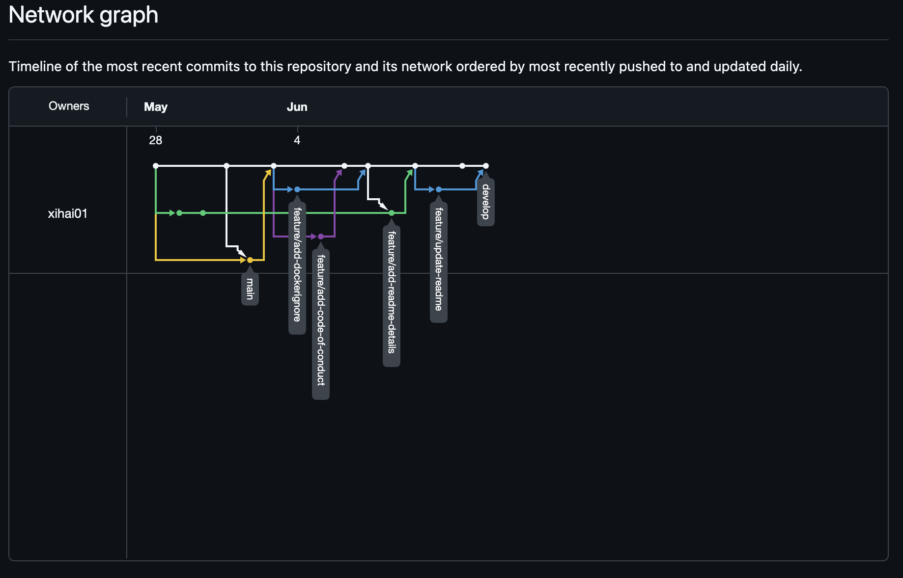
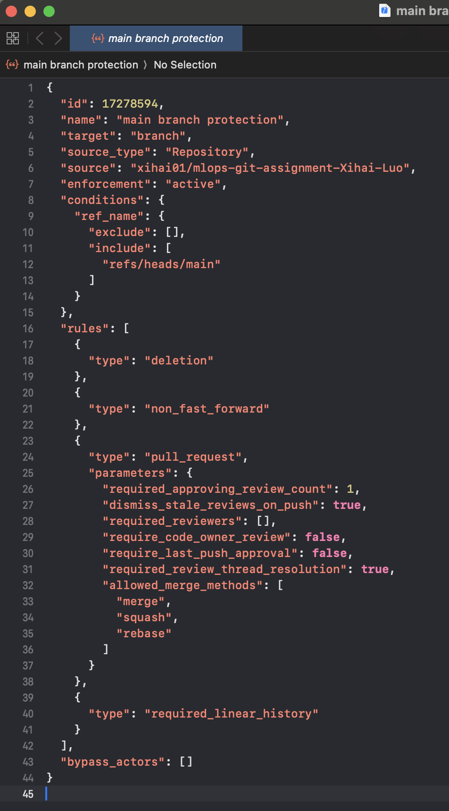
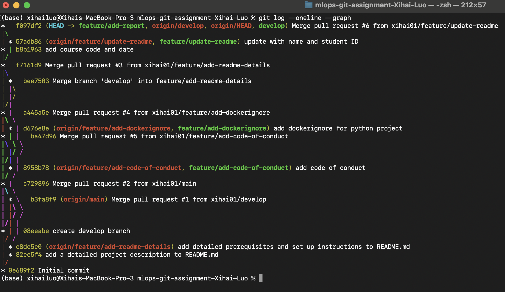

# Assignment 1 Report: Git Branching & Collaboration
## GitHub Network Graph

## Branch Protection Rules

* exported from GitHub as .json
## Git Log Output

## Reflection on Resolving Merge Conflicts
Resolving merge conflicts can be quite challenging because it requires a deep understanding of the codebase and the changes made by different branches. Fortunately, the merge conflicts in this assignment were relatively straightforward since it was adding the README.md with some text.

However, in more complex situations, e.g., industry ML project with multiple teams across different geographical locations, merge conflicts can involve multiple files and changes that are not easily reconcilable and would need team collaboration to resolve.
